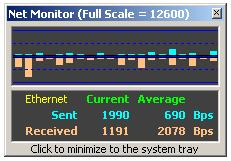



## NET\_Monitor

### Description

Error overflow corrected.

Graphical display for a network bandwidth monitor

Update to code found on PSC… Class modules belong to Shane Croft

http://www.Planet-Source-Code.com/vb/scripts/ShowCode.asp?txtCodeId=32253&lngWId=1

I added the GUI.
 
### More Info
 

             |
---                |---
**Submitted On**   |2002-09-19 10:19:18
**By**             |[Tony Albutt](https://github.com/Planet-Source-Code/PSCIndex/blob/master/ByAuthor/tony-albutt.md)
**Level**          |Beginner
**User Rating**    |5.0 (40 globes from 8 users)
**Compatibility**  |VB 6\.0
**Category**       |[Miscellaneous](https://github.com/Planet-Source-Code/PSCIndex/blob/master/ByCategory/miscellaneous__1-1.md)
**World**          |[Visual Basic](https://github.com/Planet-Source-Code/PSCIndex/blob/master/ByWorld/visual-basic.md)
**Archive File**   |[NET\_Monito164276982003\.zip](https://github.com/Planet-Source-Code/tony-albutt-net-monitor__1-39198/archive/master.zip)

